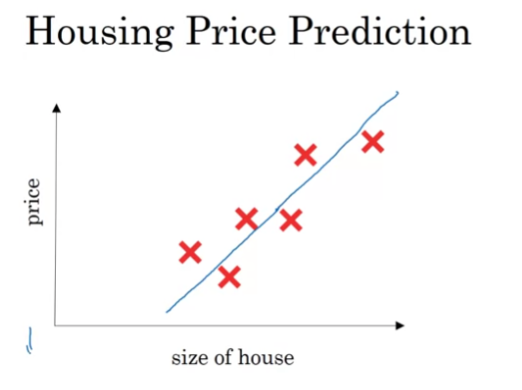
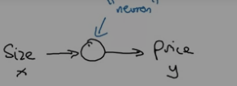
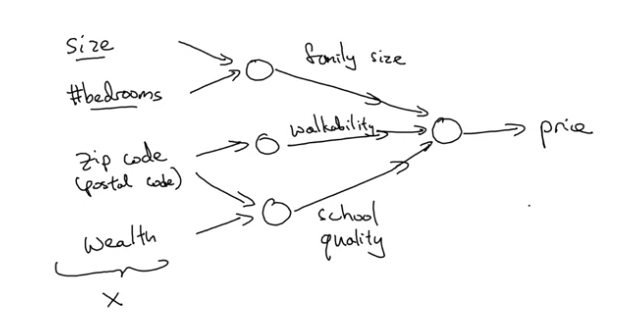
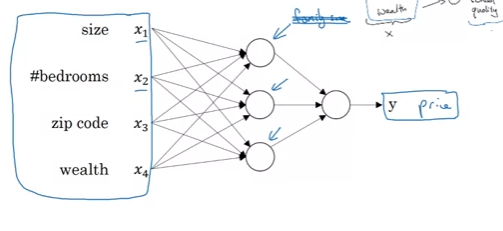
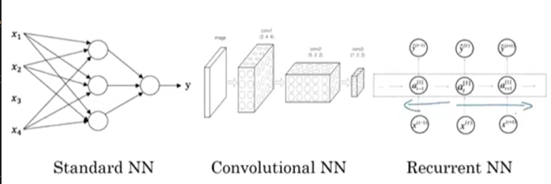

## Welcome to myy jorni of studying Deep Learning raahh !!

If this **_IS YOUR FIRST TIME HERE_** (why.???) I am Arjun currently pursuing my btech in CSE-AIML at pes university (the campus with space to breathe.)

This write-up is based off **_Andrew Ng's Deep Learning course!_** 
---

## Introduction! 
- **_Neural Network!_** : Sooo....really popular term rn lol , so yes , assume our best budy , house price prediction. 

</img>

- The straight line that u see is what is used for a _"Prediction"_. Now the size of this...goes into the node of a neural network... some what like this

</img>

- That circle u see is called a _"neuron"_ this takes the size X and gives an output Y .. 

- Lets say , instead of just size as the graph above , we now take other parameters like rooms and BHK stuff lol , soo...now based on all of these if we had to form a "neuron" as such , then there would be multiple **_neurons_** , which would then make up a network , or a fully built ***"neural network"*** 

</img>

- In the above image we see that there are 4 inputs each leading to their respective neurons , which in turn lead to their own respective neurons , finally taking us to the final node that returns us the price of these homes , each of the node take an input from EVERY FEATURE , i shall attach a neater diagram in a bit. 

</img>

- Yep , there ya go , so each of these features are going to each of the node , if you followed the arrows carefully , u'd notice that easily!. 

``` 
Supervised Learning , think it of a learning method a Machine Learning Model has.. Okay , similar to how we give exams ?? Soo theres pyq's and we solve them LOOKING AT A ANSWER KEY , THE MOST IMPORTANT KEY WORD , an ANSWER KEY. So in ML terms when a model learns with a labelled dataset , such a method of learning is called ***Supervised Learning***
``` 
### Neural Network and its examples 
- Heres a small image description about different types of neural networks (dont worry we'll be going through all of them really soon and start working with the same)

</img>


