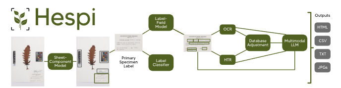
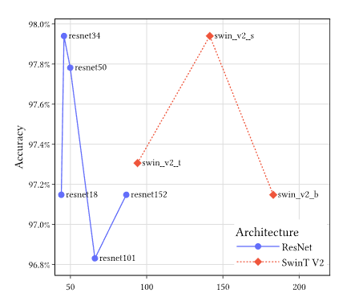

# HESPI : A PIPELINE TO DETECT INFORMATION ON HERBARIUM 

#### _This write-up is based off a oxford publish research paper on <u>```Hespi : a pipeline for automatically detecting information from herbarium specimen sheets```</u> , published by Robert Turnbull , Emily Fitzgerald , Karen M.Thompson and Joanne L. Birch_
----


### <u>Problems faced with Herbarium Specimens.</u>
There are over thousands of Herbaria globally . Where each contain like over 400 million physical specimens with valuable biological data. 

Digitizing these information has been happening over the past decade and is still in the process. 

One of the major issues in this field comes from Manual transcription of specimen labels , where the extraction rate of these specimens have been remained flat for over a long period of time. 

So in brief , researchers needed something , a tool which would help them to immediately extract informaton from such labels , fast and efficiently while also delivering the information to researchers accurately. 

**_This brought in the need for automation of these specimen labels and hence the birth of ```HESPI```_** 

----
### What is "hespi"?
- **_Hespi_** Stands for Herbarium specimen sheet pipeline. Hespi uses advanced computer vision techniques to extract data applicable for a range of research purposes. 

- Hespi combines multiple methods to automate specimen data extraction such as:
    1. **_Component detection:_** Deep-learning models detect various parts of specimen sheets. 
    2. **_Field Detection_** : identifies fields within primary specimen labels. 
    3. **_Text recognition_** : Uses 
        - OCR (Optical Character Recognition) for printed / typed text. 
        - HTR (Handwritten text recognition) for handwritten labels. 
        - Multimodal LLM's for parsing unstructured text and formatting data.

</img>

- How does Hespi work?
    1. Hespi takes a specimen sheet and detects various components using the ```sheet-component``` model.
    2. The primary specimen label is detected and cropped to serve as input for the label-field model , which detects texts in a subset of data fields written on the label. 
    3. A neural network label calssifier is used to determine the tupe of text. 
    4. Text within each field is recognized using OCR and HTR. 
    5. Rcognized text is processed and cross checked against the particular dataset for specific fields 
    6. The recognized text is then given to a multimodel LLM for correction. 
----

### Hespi's "Sheet-Component Model" 
- This is an object detection model on YOLOv8 that analyzes specimen sheet images for. 
    1. Primary Specimen Label : Containing time of collection , location of collection. 
    2. Off-Label Data : information outside the labels on the specimen sheet (like collecting data) usually handwritten 
    3. Annotation Label : taxonomic and curatorial annotations of the specimen . 
    4. Herbarium Samples : Official samples from herbarium 
    5. Swing Tags : tags physically attached to specimens. 
    6. External Numbers : such as accession number , collectors collection number and donation loan number. 
    7. Small Database Labels : Printed labels with some information. 
    8. Medium Database Labels : printed labels with unique specimen identifier with additional curatorial data. 
    9. Full Database Labels : Printed labels where primary collection info are digitalized. 
    10. Color target and Scale. 

- This , alongside the help of YOLOv8 helped the developers achieve a accuracy of 98.5%. (Trained on 4821 specimen sheet images and validated using 1180 images.)

### Hespi's "Label-Field Model":

1. This model takes any primary specimen label detected from the sheet component model and detects bounding boxes for the said field. 
    1. Family
    2. Genus
    3. species 
    4. infraspecific taxon 
    5. collectors field number
    6. the collector and locality of collection 
    7. geolocation 
    8. the collection date. 

2. Label Classifier : detects 5 types of writing on primary specimen labels 
    1. Typewritten 
    2. printed 
    3. handwritten 
    4. combination
    5. empty labels.
    6. Model Architecture : ResNet and Swin Transformer. 
    7. Training Parameters : 20 epochs , batch size of 16 and 1024 pixels. 
    8. Best Performers : 
        1. ResNet 97.9% accuracy 
        2. Swin Transformer V2 : 97.9% accuracy 
 

| Dataset Count | Types |
| :--- | :--- |
| 2521 | Training images |
| 631 | Validation images |

</src>

### Text Recognition Module :

- Each field detected by label-field module goes through text recognition. This conists of two complimentary engines.

    1. TesseractOCR : for printed and typed text.
    2. TrOCR large HTR model : for handwritten text . 
    3. Standardized format applied to family , genus , species fields (title , lower case and punctuations etc. )
    4. Taxonomic validation :  validating with datasets. 
    5. Matching approach : Gestalt similarity algorithm 
        - Default threshold of 80% adjustable by the user. 
        - Corrects orthographic variants , misspellings and non standard appreviations , OCR/HTR Errors
    6. Model Selection Logic 

### LLM Correction: 
- Text recognition resullts are then passed into a multimodel LLM for error correction. By default GPT-4o is used. 
- The input includes 
    - Image of primary specimen label 
    - currently accepted text for each field. 
    - outputs from teserract and TrOCR engines. 
    - Text adjustmnet after database cross checking 

### Pipeline Output : 
- Contains cropped images and predictions. 
- Output is in the usual CSV files with a match score for all OCR HTR Results. 
- Match score interpretation 
     -  <u>1.0</u> : Perfect match with no corrections
     - <u>0.8-1.0</u> :  Similarity range showing how close the match was
     - <u>0</u> : no match found. 

### Hespi and Computer Vision. 
- Hespi achieves 4 significant innovations in deep learning for specimen digitization. 
1. Object detection of non-plant sheet components : rulers color bars , text data on labels , handwritten specimen data . 
2. Object detection of individual data field : from primary institutional specimen labels. 
3. Specialized HTR Software : dedicated handwritten text recognition 
4. Multimodal LLM Correction : text error with correction using large language models with image context

### Conclusions
- Hespi is an open-source pipeline for automatically extracting and recognizing textual data from herbarium specimen sheets
- Input: Specimen sheet images
  Output: Formatted information including text from primary specimen labels
- Key improvement: Multimodal LLM correction          substantially improves OCR/HTR results
- Performance: Achieves accurate results on diverse test datasets across multiple herbaria
- Flexibility: Components can be fine-tuned for other herbaria and contexts
- Impact: Can be incorporated into wider digitization strategy to mobilize vast quantities of biodiversity data from specimen sheets
- Future: Enables access to wealth of data associated with herbarium specimens


   


